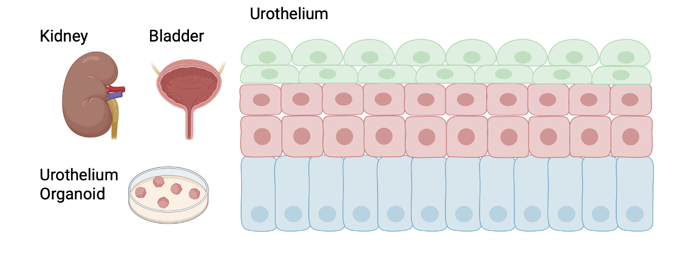
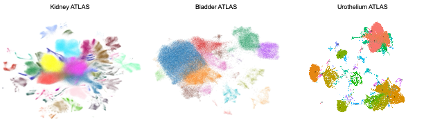
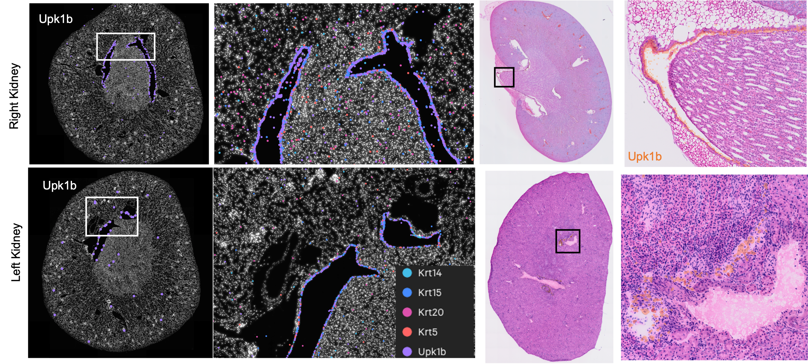

# Urothelium of the Urinary Tract at Single-cell Resolution

The urothelium forms a specialized epithelial barrier that lines the entire urinary tract, from the renal pelvis and ureter to the bladder, yet its cellular diversity and regional specialization remain poorly understood. While bladder urothelium has been extensively studied, the molecular architecture of upper urinary tract urothelium and its relationship to bladder epithelium remain largely unexplored. In particular, the renal pelvis urothelium—the first epithelial barrier of the kidney collecting system and a primary site of injury in obstructive nephropathy—has not been systematically characterized at single-cell resolution.


Here, we present a comprehensive single-cell and single-nucleus atlas of mouse urothelium spanning the kidney, ureter, and bladder. From large-scale integrations of whole kidney (797,381 cells across 89 datasets) and whole bladder (90,230 cells across 10 datasets)—encompassing healthy tissue as well as ischemia-reperfusion (AKI/IRI), obstructive (UUO), and cyclophosphamide-induced injury models—we extracted urothelial cells using a multi-arm, marker-based classification scheme (umbrella-cell uroplakins; basal Krt5/Krt14/Trp63; intermediate Epcam/Krt7/Krt8 with Foxa1/Gata3; and pan-keratin markers), applying a kidney-epithelial exclusion score to remove tubular contamination from kidney-derived data. This yielded 189,657 high-confidence urothelial cells, which we integrated with urothelial organoids derived from bladder and ureter and with in-house generated **kidney urothelium organoids (KUDO)**, as well as developmental and human datasets. In total, the atlas harmonizes 34 single-cell and single-nucleus datasets across multiple platforms and tissue sources using Harmony and scVI/scANVI. Through cross-organ, cross-system, and cross-species analyses, we define conserved and region-specific urothelial identity programs, establish organoid models that recapitulate native urothelial states, and provide a molecular framework for understanding urothelial biology across the urinary tract.



To spatially validate and localize the urothelial cell types identified in the single-cell atlas, we profiled healthy mouse kidneys using two complementary spatial transcriptomics platforms: 10x Xenium in situ transcriptomics and 10x Visium HD. Cell type deconvolution and label transfer from the single-cell atlas confirmed the spatial distribution of umbrella, basal, and intermediate urothelial populations, anchoring the transcriptionally defined states to their native renal tissue microenvironments.



For more details, please find the wiki page:    
https://github.com/gucascau/UrotheliumMouse/wiki   

## Datasets

### Kidney

| Sample ID | Accession | Technology | Condition |
|---|---|---|---|
| KidneyHealthy1 | GSE119531 | Drop-seq | Healthy |
| KidneyUUO1 | GSE119531 | snRNA-seq | UUO |
| KidneyE18_5_1 | GSE108291 | 10X v2 | Normal (E18.5) |
| KidneyHealthy2 | GSM4151577 | 10X v2 | Sham |
| KidneyUUO2 | GSM4151578 | 10X v2 | UUO day 2 |
| KidneyUUO3 | GSM4151579 | 10X v2 | UUO day 7 |
| KidneyrUUO1 | GSM4151580 | 10X v2 | rUUO |
| KidneyHealthy3 | GSM5333084 | 10X v3.1 | Sham |
| KidneyUUO4 | GSM5333085 | 10X v3.1 | UUO 10 days |
| KidneyUUO5 | GSM5333086 | 10X v3.1 | UUO 10 days |
| KidneyHealthy4 | GSM8417119 | snRNA-seq | Sham |
| KidneyHealthy5 | GSM8417120 | snRNA-seq | Sham |
| KidneyUUO6 | GSM8417121 | snRNA-seq | UUO 4 days |
| KidneyTET2UUO | GSM8417122 | snRNA-seq | TET2KO UUO 4 days |
| EmbryosE9_5ToE13_5 | GSE119945 | sci-RNA-seq3 | Development |
| KidneyUUO7 | GSE264184 | Dense matrix | UUO 10 days |
| KidneyUUO8 | GSE264184 | Dense matrix | UUO 10 days |
| MKA | MKARDS | Mixed | Atlas |
| ChenSpatial | ChenRDS | Mixed | Sex-specific |
| LakesnRNA | LakesnRDS | Mixed | Reference |

### Bladder

| Sample ID | Accession | Technology | Condition |
|---|---|---|---|
| BladderNormal1 | GSM3723360 | 10X v2 | Normal bladder |
| BladderNormal2 | GSM3723361 | 10X v2 | Normal bladder |
| BladderUro1 | GSM4970435 | 10X | Healthy urothelium |
| BladderWT1 | GSM4201633 | 10X | WT mouse bladder |
| BladderB8W1 | GSM5014059 | 10X | Healthy 8 wks |
| BladderB8W2 | GSM5014060 | 10X | Healthy 8 wks |
| BladderH48_1 | GSM5014061 | 10X | Acute CPP 48h |
| BladderH48_2 | GSM5014062 | 10X | Acute CPP 48h |
| BladderD11_1 | GSM5014063 | 10X | Chronic CPP 11 days |
| BladderD11_2 | GSM5014064 | 10X | Chronic CPP 11 days |

### Bladder Urothelium Organoid

| Sample ID | Accession | Technology | Condition |
|---|---|---|---|
| BladderHomogenate1 | GSM3827175 | 10X | Bladder organoid |
| BladderHomogenate2 | GSM3827176 | 10X | Bladder organoid |

### Ureteral Urothelium Organoid

| Sample ID | Accession | Technology | Condition |
|---|---|---|---|
| UreterOrganoid | GSM8635363 | 10X | Ureter organoid |

### Kidney Urothelium Organoids (**KUDO**)

| Sample ID | Accession | Technology | Condition |
|---|---|---|---|
| KudoUrothelium | In-house | PIPseq  | kidney urothelium organoid |

## Requirements

### R packages

- Seurat v5, harmony, DoubletFinder
- SingleCellExperiment, DropletUtils
- org.Mm.eg.db (Ensembl → gene symbol mapping)
- ggplot2, dplyr, patchwork, Matrix

### Python packages

- scvi-tools >= 1.2.1
- scanpy >= 1.9
- torch 2.5.1+cu124
- leidenalg, igraph, anndata

## Urothelium Extraction Criteria (4-arm gate)

A cell is **kept** if it passes **any arm** AND the **kidney score filter**.

### Arms

| Arm | Markers | Logic | Tissues |
|-----|---------|-------|---------|
| **Umbrella** | Upk1a, Upk1b, Upk2, Upk3a, Upk3b | any > 0 | All |
| **Basal** | Krt5, Krt14, Trp63 | ≥ 2 of 3 > 0 | All |
| **Intermediate** | Epcam, Krt7, Krt8, Foxa1/Gata3 | all four expressed simultaneously | All |
| **Pan-keratin** | Krt8, Krt18, Krt19 | any > 0 | **Non-kidney only** |

> **Why pan-keratin is excluded from kidney:**
> Krt18 is expressed in kidney proximal tubular cells, so it cannot safely gate
> kidney urothelium on its own. Bladder and ureter have no tubular contamination,
> so Krt8/Krt18/Krt19 are safe universal markers there. Ureter urothelium also
> expresses lower uroplakins than bladder, and the strict intermediate arm
> (requiring all 4 markers simultaneously) loses genuine cells to scRNA-seq
> dropout — the pan-keratin arm recovers them.

### Kidney-specific filter

```text
KidneyEpiScore = AddModuleScore(tubular markers)
Keep if KidneyEpiScore1 < 0.2
```

Tubular markers scored:

| Cell type | Markers |
|-----------|---------|
| Proximal tubule | Slc34a1, Lrp2, Cubn |
| TAL | Umod, Slc12a1 |
| DCT | Slc12a3 |
| Collecting duct principal | Aqp2, Aqp3, Scnn1g |
| Intercalated cells | Atp6v1b1, Slc4a1, Foxi1 |

### Final gate logic

```text
keep = (umbrella | basal | intermediate | pan_krt) & kidney_score_ok
```


## Contact

For questions about the analysis, please contact:

Xin Wang
KUTC Bioinformatics Team  
Kidney and Urinary Tract Center  
Nationwide Children's Hospital  
xin.wang@nationwidechildrens.org